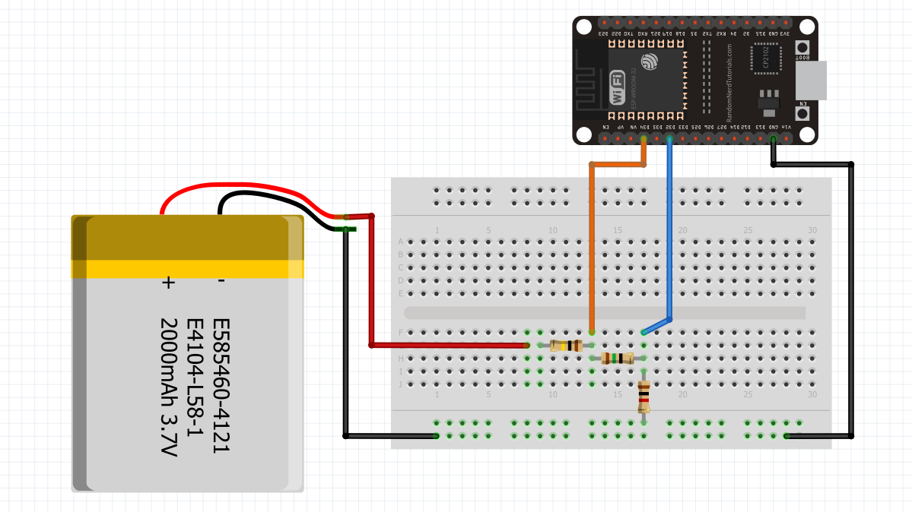

# 1. Amperímetro y Voltímetro digital.
Haciendo uso de 3 resistencias se pudo medir el voltaje y el amperaje de una batería de litio pequeña. Asimismo, se publicaron los datos en la plataforma IoT Blynk, a través de dos Dashboards. [Ver proyecto](/arduino_projects/voltimetro/voltimetro.html)

