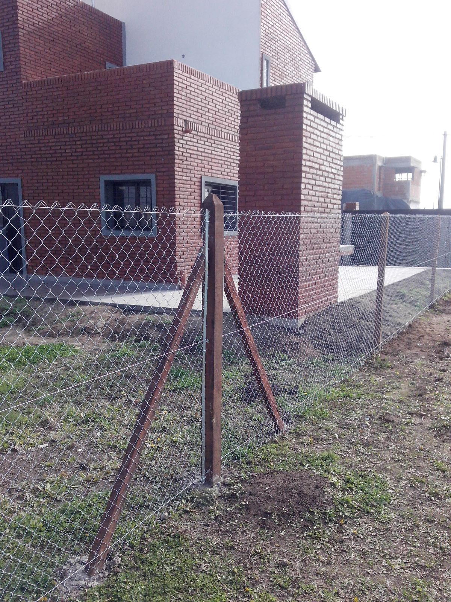
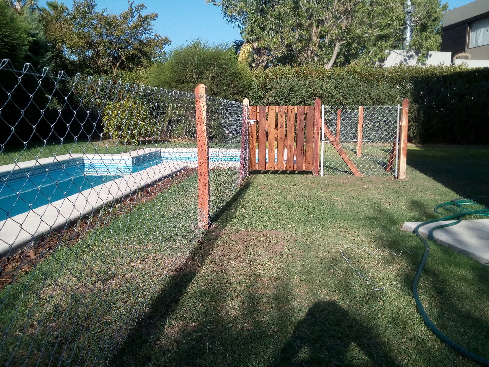
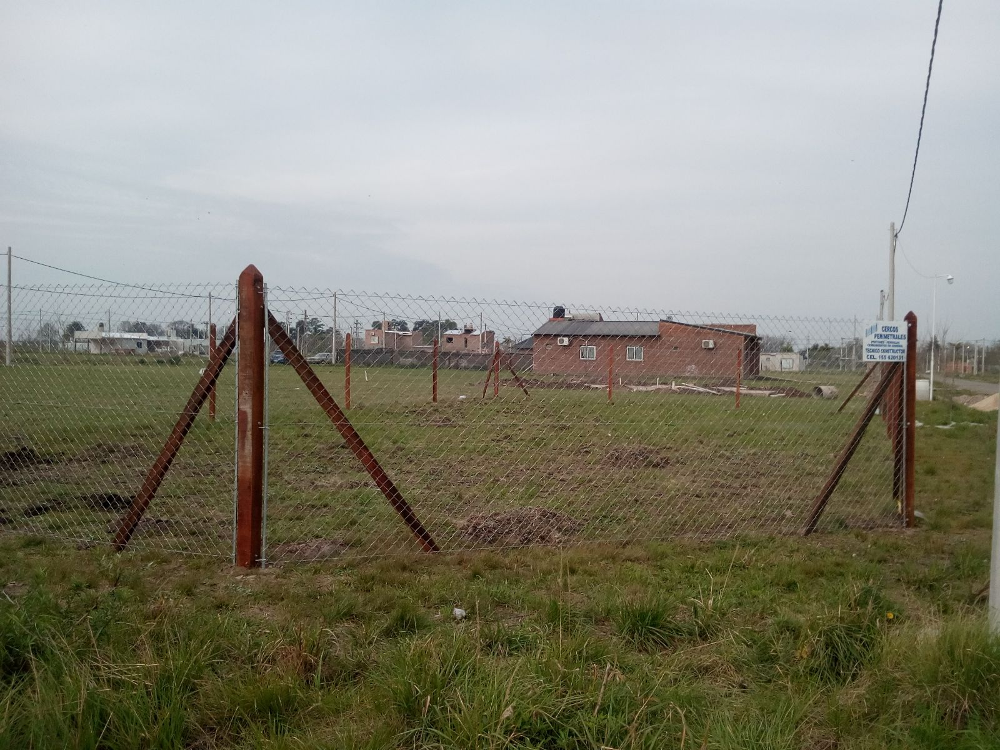
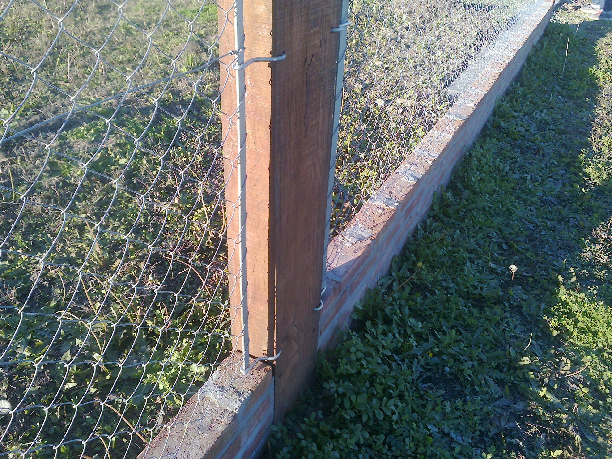

# Cercos Perimetrales

* Quebracho y caño
* Cinta para cerco
* Tejidos romboidales
* Cercos de malla galvanizada
* Cercos de pileta
* Zócalo / cordón
* Pilares y Pilares EPE

1 - Cerco de tejido romboidal:

2 - Cerco de pileta:

3 - Cerco de pileta:

4 - Cerco de tejido romboidal:

5 - Cerco con durmientes y zócalo de ladrillos:

