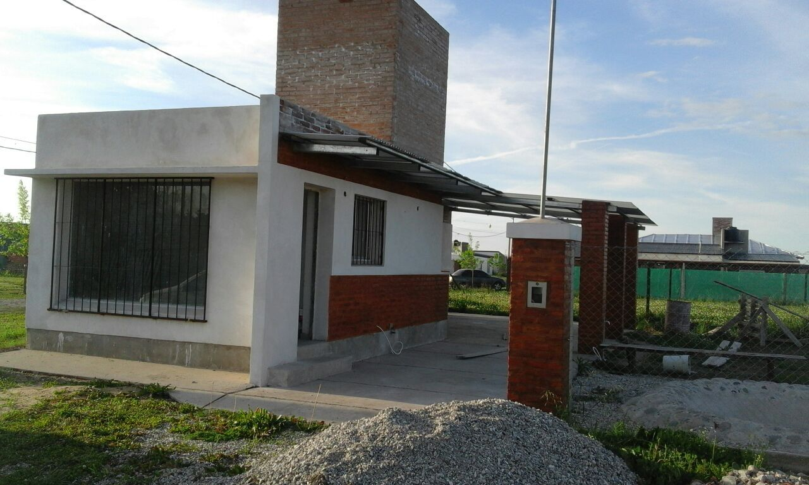
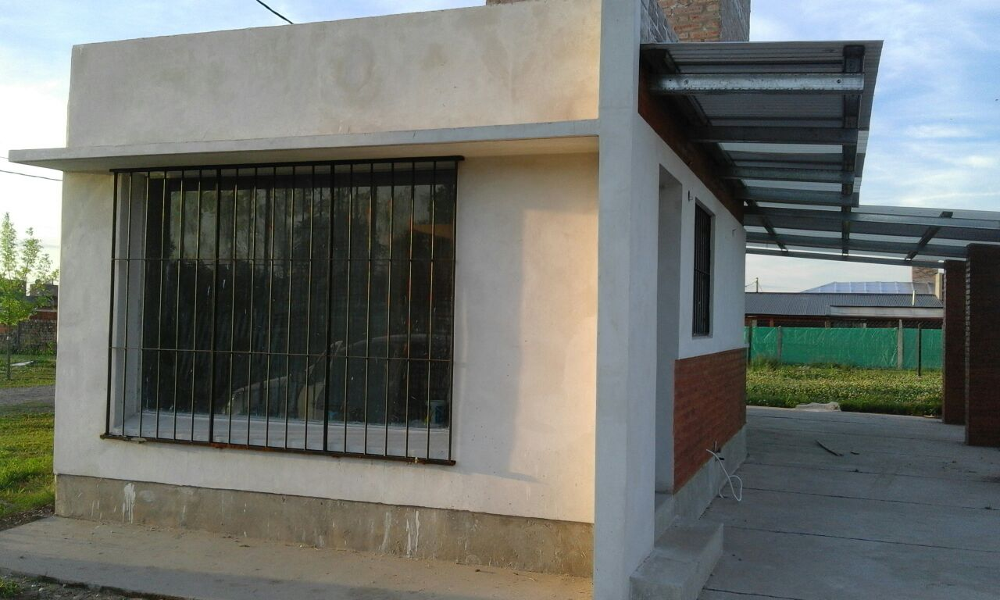
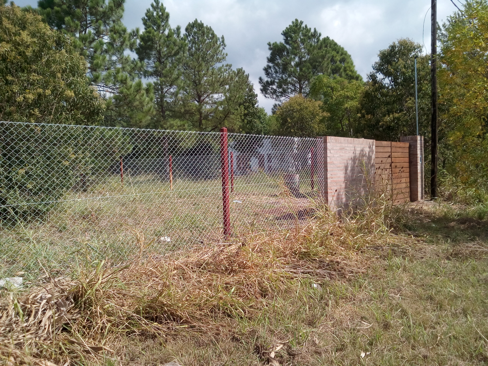
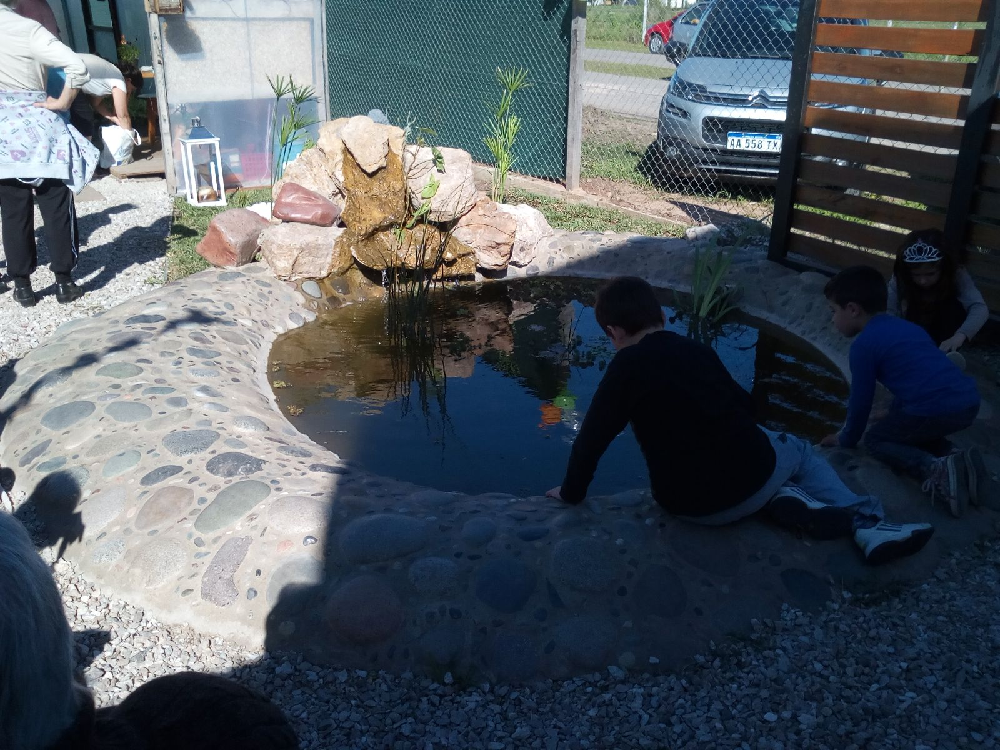
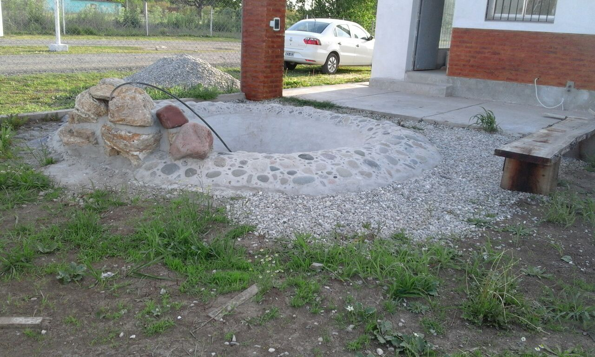
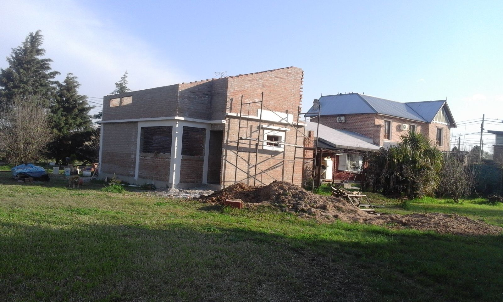
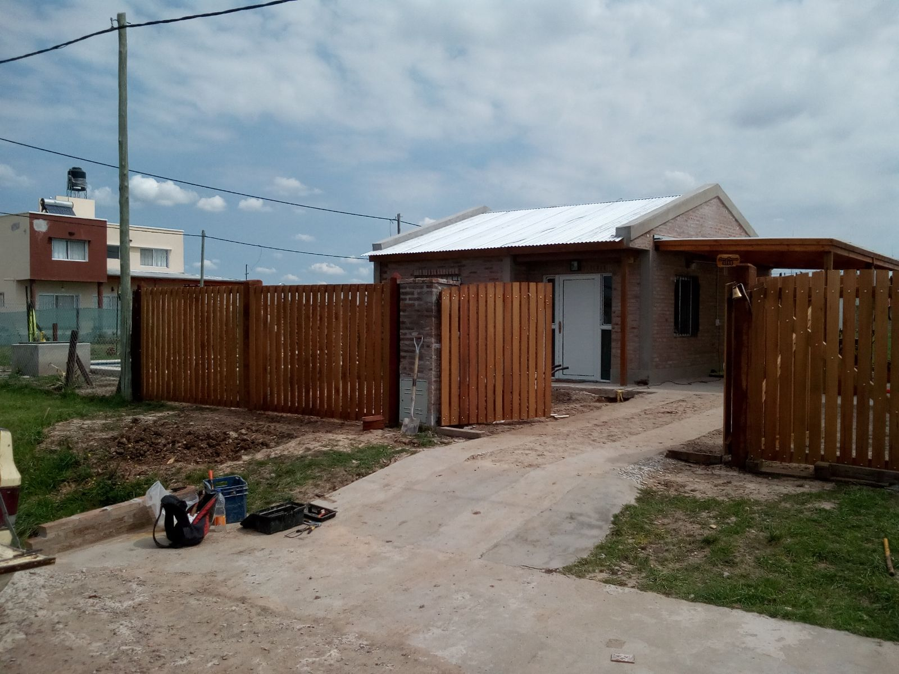
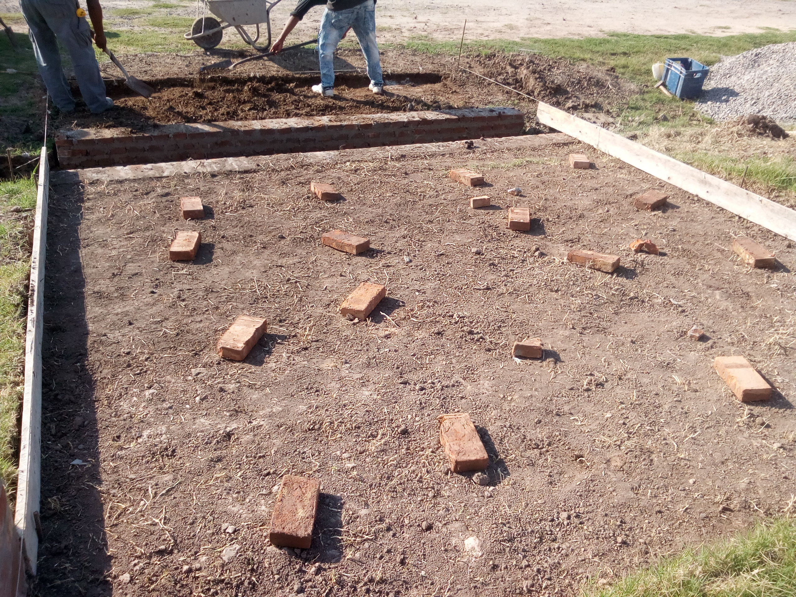

# Construcción General

* Construcción de viviendas
* Reparaciones
* Puentes, veredas y caminos
* Pilares
* Fuentes y cascadas
* Pérgolas y galerías
* Frentes y Fachadas

1 - Construcción completa:

2 - Construcción completa:

3 - Trente de terreno:

4 - Fuente con cascada:

5 - Fuente con cascada en construcción:

6 - Vivienda:

7 - Frente de madera:

8 - Puente en construcción:

9 - Pilares y cerco:
